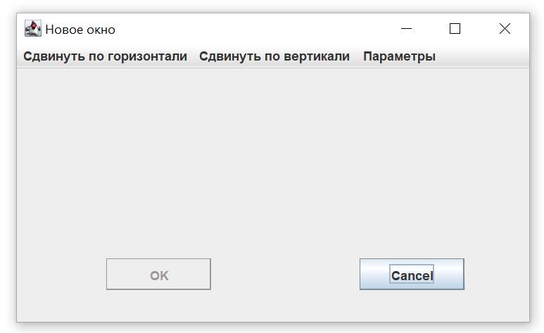
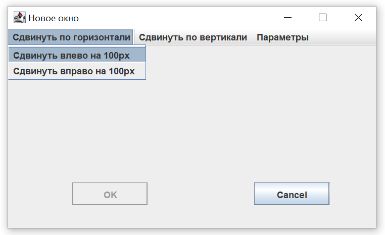
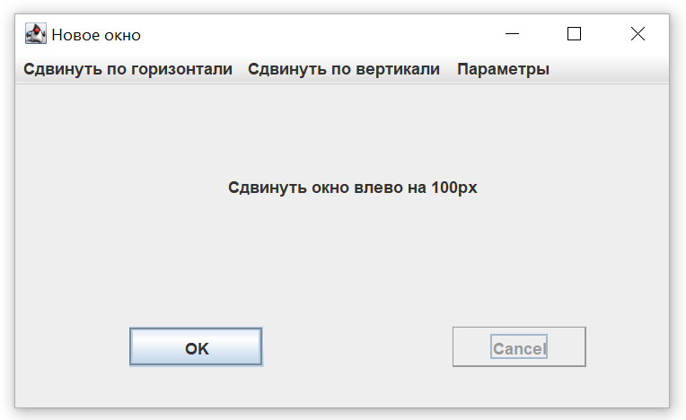
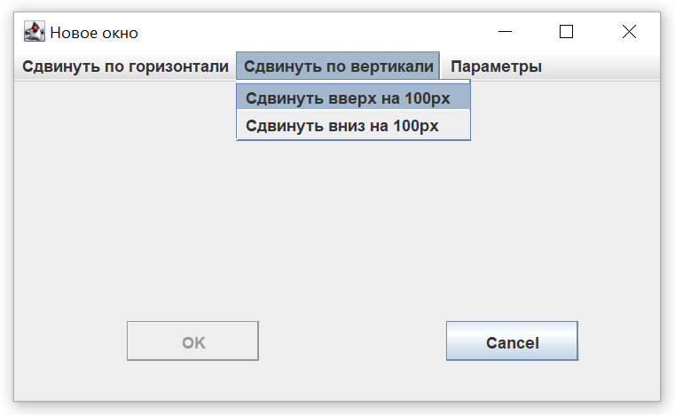
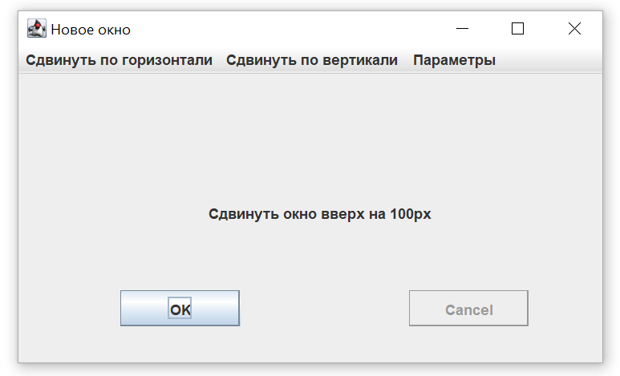
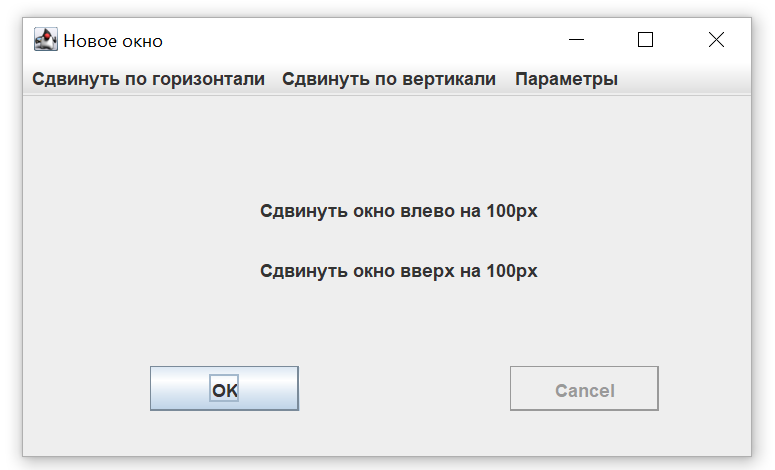
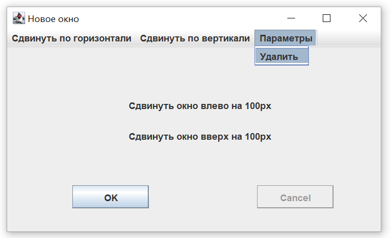

# Move window (java)
Приложение, демонстрирующее знакомство с библиотекой Swing. Представляет из себя окно, которое можно двигать через команды в меню.

Технологии: **java, swing**.
  

Пример работы приложения:

1. При запуске приложения открывается следующее окно:

    

    Кнопка "Cancel" позволяет выйти и закрыть приложение.

   
2. Попробуем изучить меню. Первое меню - "Сдвинуть по горизонтали":

   
    
3. Например, выберем пункт "Сдвинуть влево на 100px":

   
    
   
   Активируется кнопка "ОК" и деактивируется кнопка "Cancel".
   При каждом нажатии "ОК" окно будет сдвигаться влево на 100 пикселей до края экрана.

5. Теперь, посмотрим меню "Сдвинуть по вертикали". Оно аналогично горизонтальому меню:

   

6. Например, выберем пункт "Сдвинуть вверх на 100px":

   
    Всё будет работать аналогично [горизонтальному меню](#horizontal_menu).

7. Если же выбрать пункт из каждого меню по очереди, то окно можно будет сдвигать по диагонали. Например:

   

    При каждом нажатии "ОК" окно будет сдвигаться одновременно на 100 пикселей влево и на 100 пикселей вверх.

8. Меню "Параметры" содержит пункт "Удалить":

   

    При нажатии свойства "Удалить" окно вернётся к [первоначальному виду](#start).